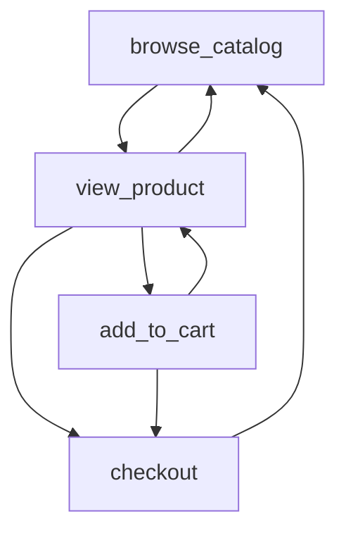

# Load Testing is Hard

Article on load testing. I feel like Locust can address a lot of the issues described here

https://www.ntietz.com/blog/load-testing-is-hard-but-why/

# Locust

[Locust](https://docs.locust.io/en/stable/) seems to address a lot of the issues here:

## MarkovTaskSet

Allows simulating user interactions as a state machine with probability based transitions. Sounds more complicated than it is:

```python
from locust import User, constant
from locust.user.markov_taskset import (
    MarkovTaskSet,
    transition,
    transitions
)

class ShoppingBehavior(MarkovTaskSet):
    wait_time = constant(1)

    @transition("view_product")
    def browse_catalog(self):
        self.client.get("/catalog")

    @transitions({
        "add_to_cart": 3,
        "browse_catalog": 1,
        "checkout": 1
    })
    def view_product(self):
        self.client.get("/product/1")

    @transitions([
        "view_product",
        "checkout"
    ])
    def add_to_cart(self):
        self.client.post(
            "/cart/add",
            json={"product_id": 1}
        )

    @transition("browse_catalog")
    def checkout(self):
        self.client.post("/checkout")

class ShopperUser(HttpUser):
    host = "http://localhost"
    tasks = {ShoppingBehavior: 1}
```


Each `@transition` task is a task that runs a unit of work in a load test. Here's a diagram in mermaid:



# Markov Chains

## Alternative polls

Instead of single winner or average, you see the most popular combinations:

Craft a dinner menu:

```
Appetizer 1 - Appetizer 2 - Appetizer 3
      Side 1 - Side 2
    Main 1 - Main 2
Dessert 1 - Dessert 2 - Dessert 3
```

You can imagine how offering both salty and sweet items on the list could help you pick the sweet favorites and the salty favorites.

## User Flow Analysis

You can also visualize where people drop off in an onboarding wizard. Optional--Send a bounce event to signal the end of a chain. Group the events by user, event names (in order), (maybe also wizard stage)
